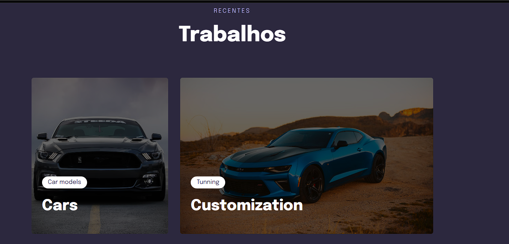

<h1 align="center"> Customização de carros </h1>

Evento exclusivo promovido pela Rocketseat para ensino de tecnologias WEB.

  <a href="#-tecnologias">Tecnologias</a>&nbsp;&nbsp;&nbsp;|&nbsp;&nbsp;&nbsp;
  <a href="#-projeto">Projeto</a>&nbsp;&nbsp;&nbsp;|&nbsp;&nbsp;&nbsp;
  <a href="#-layout">Layout</a>&nbsp;&nbsp;&nbsp;|&nbsp;&nbsp;&nbsp;
  <a href="#-aprendizado">Aprendizado</a>&nbsp;&nbsp;&nbsp;|&nbsp;&nbsp;&nbsp;
  <a href="#memo-licença">Licença</a>

  

 

  

## 🚀 Tecnologias

Esse projeto foi desenvolvido com as seguintes tecnologias:

- HTML e CSS
- Git e GitHub

## 💻 Projeto

Esse projeto é uma página de customização de carros.

## 🔖 Layout

Você pode visualizar o layout do projeto através [DESSE LINK](https://www.figma.com/file/gs8Lt48zemLf3ecUN7s0jv/Explorer-Stage-03-Projeto-03-(Copy)?). É necessário ter conta no [Figma](https://figma.com) para acessá-lo.  

## 🧠 Aprendizado

Nesse projeto eu aprendi;

- HTML.
- CSS e suas propriedades.
- Animações do CSS.

## :memo: Licença

Esse projeto está sob a licença MIT.

---
